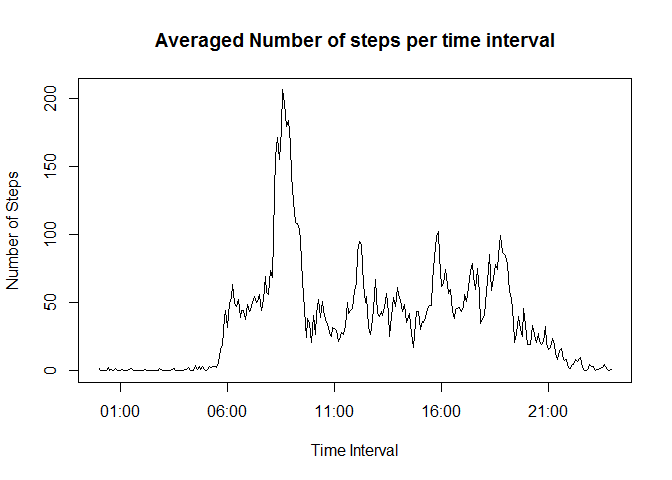
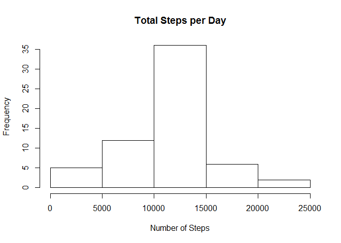
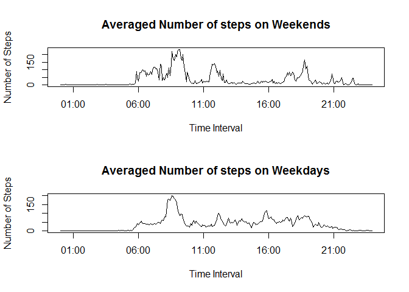

# Reproducible Research: Peer Assessment 1


## Loading and preprocessing the data
Read the data from the .zip file in to data frame d

```r
unzip("activity.zip")
d <- read.csv("activity.csv")
```
Ensure that the date column in the data is in the correct format to make downstream process easier.

```r
d$date <-  as.Date(as.character(d$date),
                   "%Y-%m-%d")
```


Add a new column to the data set, time, which shows the actual time for each interval reported

```r
temp <- sprintf("%04d", d$interval)
temp <- format(strptime(temp, format = "%H%M"), format = "%H:%M")
temp <- as.POSIXct(strptime(temp, "%H:%M"))
d <- mutate(d, time = temp)
rm(temp)
```
Turn the complete data frame in to a list of data frames, where each element of the list represents a single day of observations. 

```r
ldata <- list()
for(i in 1:(as.integer(max(d$date) - min(d$date)) + 1))
{
  tempdate <- min(d$date) + i - 1
  ldata[[i]] <- subset(d, date == tempdate)
}
rm(i, tempdate)
```
***

## What is mean total number of steps taken per day?
We want to show the avergae number of taken per day during the testing period.


```r
stepsperday <- as.data.frame(NULL)
for (i in 1:61)
{
  stepsperday[i,1] <- sum(ldata[[i]][1])
  stepsperday[i,2] <- head(ldata[[i]][2], 1)
}
rm(i)
stepsperday$date <- as.Date(stepsperday$date, origin = "1970-01-01")
hist(stepsperday$V1, 
     xlab = "Number of Steps",
     main = "Total Steps per Day")
```


The test subject took an average of 10766 steps per day, with a median of 10765.

***

## What is the average daily activity pattern?
We want to show the average number of steps taken per interval during the testing period.


```r
avesteps <- as.data.frame(NULL)
for (i in 1:288)
{
  temp <- subset(d, d$interval == d$interval[i])
  avesteps[i, 1] <- mean(temp$steps, na.rm = TRUE)
}
temp <- ldata[[1]]
avesteps <- mutate(temp, avesteps = avesteps$V1)
plot(avesteps$time, avesteps$avesteps,
     type = "l",
     xlab = "Time Interval",
     ylab = "Number of Steps",
     main = "Averaged Number of steps per time interval")
```



The maximum number of steps taken in a time interval is 104 step, which occured in between the 08:35 and 08:40 intervals.

***

## Inputing missing values
There are some missing data values in the steps column. In total, we have 2304 missing pieces of data.

A simple way to fill in any missing pieces of data is to replace them with the mean number of steps taken during the rest of the corresponding intervals.

```r
corrected <- d
for (i in 1:dim(d)[1])
{
  if (is.na(d$steps[i]))
  {
    corrected$steps[i] <- avesteps$avesteps[i %% 288 + 1]
  }
}
```

We now have a new dataset called "corrected" which has has the missing (NA) data replaced with the averaged data from the rest of the data set.


```r
cdata <- list()
for(i in 1:(as.integer(max(corrected$date) - min(corrected$date)) + 1))
{
  tempdate <- min(corrected$date) + i - 1
  cdata[[i]] <- subset(corrected, date == tempdate)
}
rm(i, tempdate)

stepsperday <- as.data.frame(NULL)
for (i in 1:61)
{
  stepsperday[i,1] <- sum(cdata[[i]][1])
  stepsperday[i,2] <- head(cdata[[i]][2], 1)
}
rm(i)
stepsperday$date <- as.Date(stepsperday$date, origin = "1970-01-01")
hist(stepsperday$V1, 
     xlab = "Number of Steps",
     main = "Total Steps per Day")
```



The test subject now took an average of 10766 steps per day, with a median of 10766. This is slightly different from the values that we caluculated when the missing data was incorporated in to the dataset.
This makes sense, as the method that was used to replace missing data simply substituted an average value.

***

## Are there differences in activity patterns between weekdays and weekends?

First, we want to include the Day of the Week (dow) in to the corrected data set we created earlier. This will be a new factor variable indicating whether the day is a weekend or a weekday

```r
corrected$dow <- ifelse(wday(corrected$date) == 1, "weekend", "weekday")
corrected$dow <- ifelse(wday(corrected$date) == 2, "weekend", "weekday")
```

Now we want to plot this on two seperate axes, showing the average number of steps per time period over weekends and over weekdays

```r
avesteps <- as.data.frame(NULL)
temp.weekend <- subset(corrected, corrected$dow == "weekend")
temp.weekday <- subset(corrected, corrected$dow == "weekday")
for (i in 1:288)
{
  steps.weekend <- subset(temp.weekend,
                          temp.weekend$interval == corrected$interval[i])
  steps.weekday <- subset(temp.weekday,
                          temp.weekday$interval == corrected$interval[i])
  avesteps[i, 1] <- mean(steps.weekend$steps)
  avesteps[i, 2] <- mean(steps.weekday$steps)
}
names(avesteps) <- c("weekendsteps", "weekdaysteps")
temp <- ldata[[1]]
temp <- mutate(temp, weekendsteps = avesteps$weekendsteps)
temp <- mutate(temp, weekdaysteps = avesteps$weekdaysteps)
par(mfrow = c(2,1))
plot(temp$time, temp$weekendsteps,
     type = "l",
     xlab = "Time Interval",
     ylab = "Number of Steps",
     main = "Averaged Number of steps on Weekends")
plot(temp$time, temp$weekdaysteps,
     type = "l",
     xlab = "Time Interval",
     ylab = "Number of Steps",
     main = "Averaged Number of steps on Weekdays")
```



This plot shows the difference between the steps take over weekends and weekdays. Unfortunately, I did not have enough time to get the factor part working and so plot the graph exactly as is in the requirements. I apologise for this.

***
